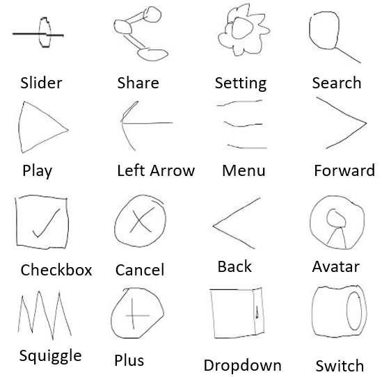

## Doodle to UI Dataset
Doodle to UI Dataset contains 11 thousand drawings from 16 categories. 

[RICO](http://interactionmining.org/rico) dataset is a collection of 66k unique UI screens from 9.3k apps from 27 Google Play app categories. According to RICO, the most common Android UI element types are- 
Container, followed by (in order) image, # icon (a small interactive image), text, text button, web view, input, list item, switch (a toggle element), map-view, slider, and checkbox. Among the icons most common elements are back, followed by menu (the hamburger), cancel (close), search (loupe), plus (add), avatar (user image), home (house), share, settings (gear), star (rating), edit, more, refresh, and forward.

The [QuickDraw](https://github.com/googlecreativelab/quickdraw-dataset) contains 345~sketch categories (from aircraft carrier to zigzag), with some 100k samples each, drawn by anonymous users. QuickDraw contains some categories that seemed like a good fit for UI Element but fails to represent the most common UI Elements. Doodle to UI Dataset contains 16 categories that can be used to represent these common UI categories. Preview of these 16 categories is shown here- 



To visualize the diverse set of freehand 16 categories-
- [Avatar](CollageImage/avatar.png)
- [Back](CollageImage/back.png)
- [Cancel](CollageImage/cancel.png)
- [CheckBox](CollageImage/checkbox.png)
- [DropDown](CollageImage/dropDown.png)
- [Forward](CollageImage/forward.png)
- [LeftArrow](CollageImage/leftarrow.png)
- [Menu](CollageImage/menu.png)
- [Play](CollageImage/play.png)
- [Plus](CollageImage/plus.png)
- [Search](CollageImage/search.png)
- [Setting](CollageImage/settings.png)
- [Slider](CollageImage/sliders.png)
- [Squiggle](CollageImage/squiggle.png)
- [Switch](CollageImage/switch.png)


With the advancement of the deep neural network, it is now possible to train a network that can recognize sketches from the order of the strokes.  Most of the designers still prefer simple art supplies to design UI. We are sharing this dataset for the researchers who are enthusiastic about automize this UI generation process. An experiment is shown in the [Doodle to UI](http://pixeltoapp.com/doodle/). This data still contain some inappropriate drawing made by the users. 


## Data Format
Strokes of these 16 categories reside in different folders. We used the same formatting used by Quickdraw.  Each drawing comprises several strokes. A single stroke symbolizes drawing made by a user without detaching a drawing pen from the digital interface.   And each stroke is a collection of straight lines, given by their x/y endpoints coordinates. 
```javascript
[ 
  [  // First stroke 
    [x0, x1, x2, x3, ...],
    [y0, y1, y2, y3, ...],
  ],
  [  // Second stroke
    [x0, x1, x2, x3, ...],
    [y0, y1, y2, y3, ...],
  ],
]
```
Here x0,x1 indicates the coordinates of the digital interface. 


## Content

- [CorrectDrawings](CorrectDrawings) - Contains 10 thousand drawings (we labeled correct) from 16 categories separated by folder of their corresponding categories.  
- [CorrectImages](CorrectImages) - Contains 10 thousand images of drawings (we labeled correct) from 16 categories separated by folder of their corresponding categories.  
- [RawDrawings](RawDrawings)  - Contains 11 thousand drawings (with incorrect drawings) from 16 categories separated by folder of their corresponding categories.  
- [RawImages](RawImages)  - Contains 11 thousand images of drawings (with incorrect drawings) from 16 categories separated by folder of their corresponding categories.   
- [PrepareData.py](PrepareData.py) - This python script helps to separate the data into the test and train category. 
- [StrokeToImage.py](StrokeToImage.py) - This script file converts the strokes into an image.
- [qlabel.txt](qlabel.txt) - Text file contains categories that are going to be included for training. 
- [tfGenerator.py](tfGenerator.py) - Script file that converts strokes to tfrecord. (the File format used by TensorFlow)
- [trainModel.py](trainModel.py) - A script to train an RNN model that uses the tfrecord file.

## Dependencies-
1. Tensorflow - '1.9.0'
2. NumPy - '1.16.5' 
3. Scikit-image -  '0.16.1'


 
